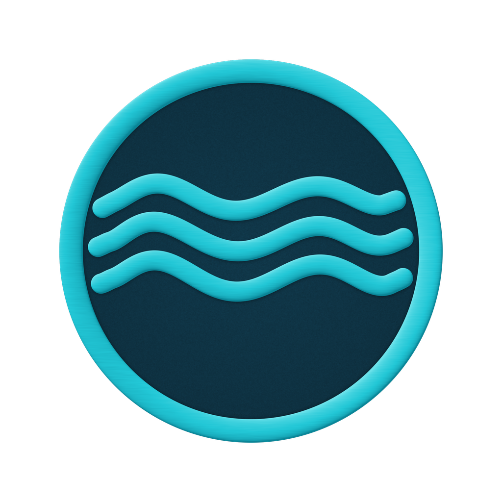

<!-- markdownlint-disable MD001 MD013 MD033 MD041 MD060 -->

<div align="center">



# Anclora SecureFlow

### Del archivo original al dato listo para usar.

Landing comercial premium para el flujo de información seguro de Anclora: prepara,
protege, extrae y automatiza los datos que hacen avanzar a una organización.


</div>

---

> [!IMPORTANT]
> Repositorio interno del ecosistema Anclora. No publicar credenciales, datos reales,
> contratos internos ni detalles operativos fuera de los canales autorizados.

## Qué es

Anclora SecureFlow es la capa comercial que reúne cuatro capacidades SaaS en un flujo
continuo de información segura:

| Capacidad | Producto | Qué resuelve |
|---|---|---|
| **Prepare** | [FileStudio](https://github.com/AncloraAI/anclora-filestudio) | Convierte y estandariza archivos para su procesamiento |
| **Protect** | [PurgeDoc](https://github.com/AncloraAI/anclora-purgedoc) | Detecta y elimina información sensible de forma verificable |
| **Extract** | [TableExtract](https://github.com/AncloraAI/anclora-tableextractor) | Extrae datos estructurados de documentos complejos |
| **Automate** | CleanSheet | Limpia, transforma e integra datos en sistemas de negocio |

La landing explica el flujo, presenta las soluciones, comunica los principios de
seguridad y recoge solicitudes de acceso anticipado. En su estado actual no envía ni
persiste formularios: `src/services/accessRequestService.ts` funciona como frontera
preparada para una futura whitelist.

## Experiencia de producto

- **Narrativa orientada a negocio:** del archivo original al dato listo para usar.
- **Diseño SecureFlow:** fondo navy, ondas de datos, cyan luminoso y tarjetas de producto.
- **Responsive por diseño:** navegación de escritorio, menú móvil y composición adaptable.
- **ES / EN:** toda la copia de la landing vive en `src/i18n/index.ts`.
- **Tema claro / oscuro:** el control sigue el patrón visual de las aplicaciones SaaS Anclora.
- **Accesibilidad base:** landmarks semánticos, foco visible, controles etiquetados y FAQ operativa.

## Stack

| Área | Tecnología |
|---|---|
| UI | React 19 + TypeScript |
| Bundler | Vite |
| Estilos | CSS propio con tokens SecureFlow |
| Calidad | ESLint + Vitest + TypeScript build |
| Assets | PNG locales, sin dependencia de un CDN para la marca |
| Runtime | Frontend estático, sin base de datos |

## Estructura

```text
anclora-secureflow/
├── .anclora/                 # Contratos operativos y adopción AOS
├── .github/workflows/        # CI de lint, tests y build
├── public/assets/             # Hero y logos del ecosistema
├── src/components/           # Secciones y controles de la landing
├── src/data/                 # Productos y planes comerciales
├── src/i18n/                 # Copia ES / EN
├── src/services/             # Fronteras de integración
├── .gitignore
├── package.json
└── README.md
```

## Puesta en marcha

### Requisitos

- Node.js 20+
- npm 10+

### Instalación y desarrollo

```bash
npm ci
npm run dev
```

Abre la URL local indicada por Vite. No es necesario configurar `.env`, una base de
datos ni credenciales para trabajar con la landing actual.

### Puertas de calidad

```bash
npm run lint
npm test
npm run build
git diff --check
```

GitHub Actions ejecuta automáticamente las tres primeras validaciones en cada push a
`main` o `anclora-secureflow` y en cada pull request.

## Gobierno del repositorio

Los contratos canónicos del proyecto viven en [`.anclora/`](./.anclora/):

- [`AGENT_PROJECT_CONTEXT.md`](./.anclora/AGENT_PROJECT_CONTEXT.md): mapa del producto y reglas de modificación.
- [`PRODUCTION_RUNTIME.md`](./.anclora/PRODUCTION_RUNTIME.md): runtime, CI, Git y secretos.
- [`AOS_ADOPTION.md`](./.anclora/AOS_ADOPTION.md): invariantes y puerta de cambio.

La política superior del workspace es `ANCLORA_WORKSPACE_AGENT_POLICY.md`.

## Estado y roadmap

- [x] Landing pública premium responsive.
- [x] Catálogo SecureFlow de cuatro capacidades.
- [x] Idiomas ES / EN y tema claro / oscuro.
- [x] Formulario de acceso con frontera no persistente.
- [x] CI reproducible de lint, tests y build.
- [ ] Conectar la whitelist real mediante contrato de servicio revisado.
- [ ] Publicar dominio comercial y analítica respetuosa con la privacidad.

## Licencia y contacto

Software propietario. Todos los derechos reservados © Anclora Group.

Para coordinación del ecosistema: [Anclora Group](https://group.anclora.com).
